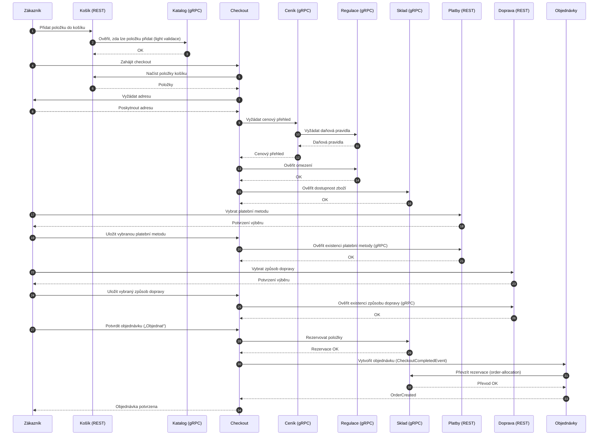

# Nákup

Poznámky:

 - Checkout neobsahuje business logiku cen ani skladových pravidel
 - Pricing a Regulatory jsou autoritativní zdroje rozhodnutí
 - Stock provádí explicitní rezervaci až při potvrzení objednávky
 - Order vzniká na základě eventu od checkoutu

