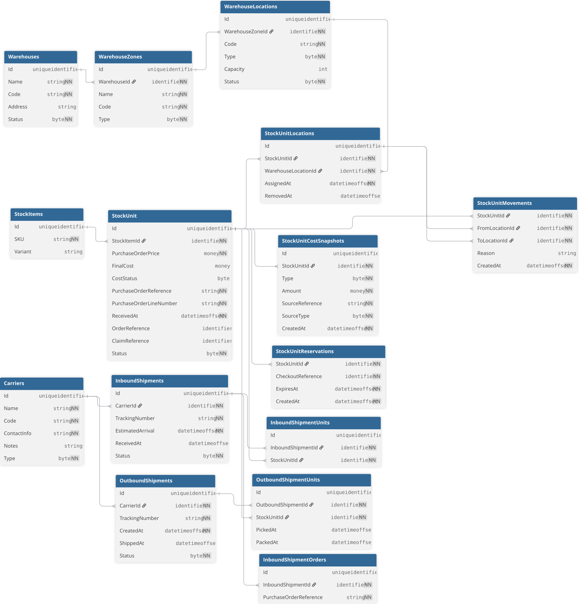

# DB schéma



??? note "dbdiagram schema"
    ```sql
    Table Warehouses {
      Id uniqueidentifier
      Name string [not null]
      Code string [not null]
      Address string
      Status byte [not null]
    }

    Table WarehouseZones {
      Id uniqueidentifier
      WarehouseId identifier [not null, REF: > Warehouses.Id]
      Name string [not null]
      Code string [not null]
      Type byte [not null]
    }

    Table WarehouseLocations {
      Id uniqueidentifier
      WarehouseZoneId identifier [not null, REF: > WarehouseZones.Id]
      Code string [not null]       
      Type byte [not null]         
      Capacity int              
      Status byte [not null] 
    }

    Table StockItems{
      Id uniqueidentifier
      SKU string [not null]
      Variant string
    }

    Table StockUnit{
      Id uniqueidentifier
      StockItemId identifier [not null, REF: > StockItems.Id]
      PurchaseOrderPrice money [not null]
      FinalCost money
      CostStatus byte
      PurchaseOrderReference string [not null]
      PurchaseOrderLineNumber string [not null]
      ReceivedAt datetimeoffset [not null]
      OrderReference identifier
      ClaimReference identifier
      Status byte [not null]
    }

    Table StockUnitLocations {
      Id uniqueidentifier
      StockUnitId identifier [not null, REF: > StockUnit.Id]
      WarehouseLocationId identifier [not null, REF: > WarehouseLocations.Id]
      AssignedAt datetimeoffset [not null]
      RemovedAt datetimeoffset
    }

    Table StockUnitMovements {
      StockUnitId identifier [not null, REF: > StockUnit.Id]
      FromLocationId identifier [not null, REF: > StockUnitLocations.Id]
      ToLocationId identifier [not null, REF: > StockUnitLocations.Id]
      Reason string 
      CreatedAt datetimeoffset [not null]
    }

    Table StockUnitCostSnapshots{
      Id uniqueidentifier
      StockUnitId identifier [not null, REF: > StockUnit.Id] 
      Type byte [not null]
      Amount money [not null]
      SourceReference string  [not null]
      SourceType byte [not null]
      CreatedAt datetimeoffset [not null]
    }

    Table StockUnitReservations {
      StockUnitId identifier [not null, REF: > StockUnit.Id]
      CheckoutReference identifier [not null]
      ExpiresAt datetimeoffset [not null]
      CreatedAt datetimeoffset [not null]
    }

    Table Carriers {
      Id uniqueidentifier
      Name string [not null]
      Code string [not null]
      ContactInfo string [not null]
      Notes string
      Type byte [not null] // inbound/outbound etc
    }

    Table InboundShipments{
      Id uniqueidentifier
      CarrierId identifier [not null, REF: > Carriers.Id]
      TrackingNumber string [not null]
      EstimatedArrival datetimeoffset [not null]
      ReceivedAt datetimeoffset
      Status byte [not null]
    }

    Table InboundShipmentOrders{
      Id uniqueidentifier
      InboundShipmentId identifier [not null, REF: > InboundShipments.Id]
      PurchaseOrderReference string [not null]
    }

    Table InboundShipmentUnits{
      Id uniqueidentifier
      InboundShipmentId identifier [not null, REF: > InboundShipments.Id]
      StockUnitId identifier [not null, REF: > StockUnit.Id]
    }

    Table OutboundShipments{
      Id uniqueidentifier
      CarrierId identifier [not null, REF: > Carriers.Id]
      TrackingNumber string [not null]
      CreatedAt datetimeoffset [not null]
      ShippedAt datetimeoffset
      Status byte [not null]
    }

    Table OutboundShipmentUnits {
      Id uniqueidentifier
      OutboundShipmentId identifier [not null, REF: > OutboundShipments.Id]
      StockUnitId identifier [not null, REF: > StockUnit.Id]
      PickedAt datetimeoffset
      PackedAt datetimeoffset
    }
    ```
